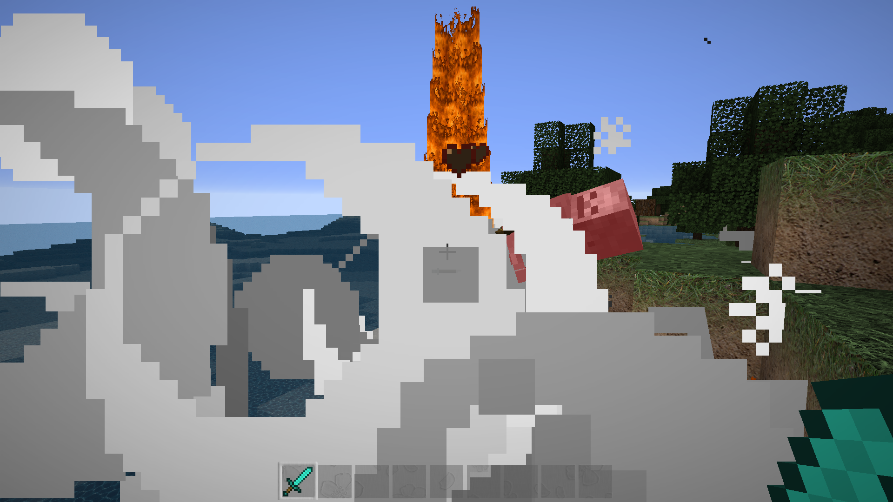

# ExplosiveMobs

A Minecraft Bukkit plugin which lets mobs explode once they die.

## Installation

You can get the latest release from [bukkit.org](https://dev.bukkit.org/projects/explosivemobs) or [GitHub](https://github.com/Programie/ExplosiveMobs/releases/latest).

You may also check out the project from the repository and build it yourself (See Build section bellow).

## Build

You can build the project in the following 2 steps:

 * Check out the repository
 * Build the jar file using maven: *mvn clean package*

**Note:** JDK 1.8 and Maven is required to build the project!

## Configuration

It is possible to configure the plugin to just have explosive mobs if they are spawned using the */spawnexplosivemob* command or simply every time a mob dies.

You can also define per mob configurations. For example you only want to have explosive sheep, but any other mob should just die without any explosion.

For more details, see [config.yml](src/main/resources/config.yml).

## Permissions

ExplosiveMobs knows the following permissions:

  * explosivemobs.spawn - Allows the player to spawn an explosive mob
  * explosivemobs.spawn.target - Allows the player to spawn an explosive mob in front of another player
  * explosivemobs.* - Allow access to all features (Default: op)

## Commands

You can use the */spawnexplosivemob* command to spawn an explosive mob.

Just execute it without any arguments to see the command usage.
